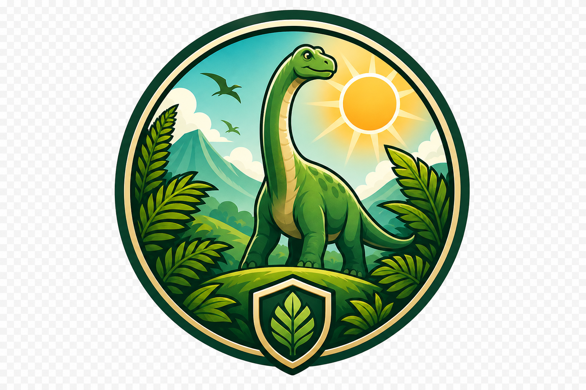

<p align="center">
  <picture>
    
  </picture>
</p>

<h1 align="center">Dino Park Manager</h1>

<p align="center">
  <em>They don't wait for you. Your park keeps living while you're gone.</em>
</p>

<p align="center">
  
  
  
  
  
</p>

<p align="center">
  <a href="#the-loop">The Loop</a> &middot;
  <a href="#what-makes-a-park">Features</a> &middot;
  <a href="#the-roster">The Roster</a> &middot;
  <a href="#your-first-hour">First Hour</a> &middot;
  <a href="#play-it">Play It</a> &middot;
  <a href="docs/">Docs</a>
</p>

---

You inherit a patch of prehistoric land, a little seed money, and three dinosaurs. From there it's on you: hatch a thriving ecosystem or preside over a very expensive graveyard.

**Dino Park Manager** is an idle/simulation tycoon game where you raise, breed, and care for dinosaurs across a living 3D park. The catch — and the whole point — is that **the park runs on real time**. Walk away for an hour and you come back to a game-day's worth of hunger, growth, births, droughts, and (if you weren't careful) loss. Every time you open it, the world has moved on without you.

> **No accounts. No passwords.** Your identity is a single portable **park code** that lives on your device. Type it into another browser and your whole park loads, exactly as you left it — still ticking. It's low-security on purpose. It's a game, not a bank.

## The Loop

<p align="center">
  <strong>Acquire &rarr; Feed &rarr; Breed &rarr; Expand &rarr; Optimize</strong>
</p>

```
   ┌──────────┐   ┌──────┐   ┌───────┐   ┌────────┐   ┌──────────┐
   │ ACQUIRE  │ → │ FEED │ → │ BREED │ → │ EXPAND │ → │ OPTIMIZE │
   └──────────┘   └──────┘   └───────┘   └────────┘   └────┬─────┘
        ↑                                                   │
        └───────────────  keep it all alive  ──────────────┘
```

- **Acquire** — Start with three starter species. Earn enough to buy more, or breed your way to a fuller roster.
- **Feed** — Every dino wants its preferred diet. Feed it right and it thrives; feed it wrong, or let it starve, and its health slides.
- **Breed** — Pair compatible dinos and incubate an egg. Offspring inherit traits from both parents, with rare **shiny**, **giant**, and **dwarf** mutations to chase.
- **Expand** — Build new habitats across five terrains, research new tech, raise farms and theme-park attractions that pay you while you're away.
- **Optimize** — Watch health, hunger, happiness, crowding, climate, and disease. A neglected dinosaur doesn't sulk. It dies.

## What Makes a Park

<table>
<tr>
<td width="50%" valign="top">

### A park you can actually watch
The entire game renders inside a real-time **3D world**. Your dinosaurs wander their habitats, each with a health bar floating overhead. Pan, orbit, and zoom across the grounds, click any creature to inspect it, and click a habitat to manage it.

</td>
<td width="50%" valign="top">

### 14 species, 3 prehistoric eras
Collect dinosaurs from the **Triassic, Jurassic, and Cretaceous** — from a 35-lb Velociraptor to a 62,000-lb Brachiosaurus. Each has its own diet, preferred terrain, social structure, and rarity.

</td>
</tr>
<tr>
<td width="50%" valign="top">

### Breeding & genetics
Genetics actually matter. Offspring roll their stats from both parents, can mutate into rare variants, and carry a **generation** and a **genetic quality** score. Build the lab and you can even steer the outcome.

</td>
<td width="50%" valign="top">

### A fragile ecosystem
Terrain sets the climate. Climate, crowding, social needs, and the right diet decide whether a dino is **Thriving** or **Critical**. Pack them too tight and disease creeps in — then it's quarantine and the vet lab.

</td>
</tr>
<tr>
<td width="50%" valign="top">

### An economy that runs itself
Living dinos and attractions earn currency on a timer. Stand up plant farms, hunting grounds, and fishing ponds so your park feeds itself. Climb a **research tree** to unlock new species, buildings, and upgrades.

</td>
<td width="50%" valign="top">

### Weather, goals & New Game+
Random **events** — droughts, floods, heat spikes — hit your farms and habitats. Chase a ladder of **goals**, and when you've truly mastered the park, **Prestige** to start over with a permanent income bonus.

</td>
</tr>
</table>

## The Roster

Fourteen species span three eras. Three are yours from day one; the rest are earned, researched, or bred into existence.

| Dinosaur | Era | Diet | Social | Rarity | Start |
|----------|-----|------|--------|:------:|:-----:|
| Coelophysis | Triassic | Carnivore | Solitary | Common | — |
| Plateosaurus | Triassic | Herbivore | Herd | Common | — |
| Herrerasaurus | Triassic | Carnivore | Pair | Uncommon | — |
| **Stegosaurus** | Jurassic | Herbivore | Herd | Common | ★ |
| Brachiosaurus | Jurassic | Herbivore | Herd | Uncommon | — |
| Dilophosaurus | Jurassic | Carnivore | Pair | Uncommon | — |
| Allosaurus | Jurassic | Carnivore | Pair | Rare | — |
| **Triceratops** | Cretaceous | Herbivore | Herd | Common | ★ |
| **Velociraptor** | Cretaceous | Carnivore | Pair | Common | ★ |
| Parasaurolophus | Cretaceous | Herbivore | Herd | Common | — |
| Ankylosaurus | Cretaceous | Herbivore | Solitary | Uncommon | — |
| Tyrannosaurus | Cretaceous | Carnivore | Solitary | Rare | — |
| Pteranodon | Cretaceous | Piscivore | Pair | Uncommon | — |
| Spinosaurus | Cretaceous | Piscivore | Solitary | Rare | — |

<sub>★ = available from your very first day. Collecting all fourteen is one of the steps to becoming a **Park Legend**.</sub>

## Your First Hour

1. **Open the park.** A keeper is born, a starter habitat appears, and three dinosaurs move in. Note your park code — that's your save.
2. **Feed everyone.** Buy food, then give each dino the diet it actually wants. Watch the health numbers settle.
3. **Build a second habitat.** Match the terrain to the species you plan to keep there. Crowding and climate both bite.
4. **Breed your first egg.** Pair two compatible, healthy dinos of opposite genders, then wait for it to incubate in real time.
5. **Plant a farm.** Research farming and raise a plant farm so your park starts feeding itself while you're away.
6. **Come back later.** Close the tab, live your life, and return to a park that kept growing, eating, and breeding without you.

## Play It

The whole game is a React app talking to a Rails API, packaged to run with one command via Podman.

```bash
# Set up secrets once, then start the whole stack (Postgres + API + web + tunnel)
cp podman/secrets.dev.example.yaml podman/secrets.dev.yaml
podman play kube podman/secrets.dev.yaml
podman play kube podman/dpm-dev.yaml
```

Then open **http://localhost:3000** and a park is created for you automatically.

Prefer the guided path, running pieces by hand, or deploying it for real? It's all written up:

- **[Development & local setup](docs/development.md)** — run it the easy way (`cmds`) or piece by piece, plus tests and troubleshooting.
- **[Deployment](docs/deployment.md)** — the Podman pods and the Cloudflare Tunnel that put it online.

## Documentation

The README is the trailer. The **[full handbook lives in `docs/`](docs/)** — how the game is built, layer by layer.

| Doc | What's inside |
|-----|---------------|
| [Architecture](docs/architecture.md) | The big picture: how the pieces fit, the request lifecycle, and the real-time "compute-on-read" model that makes the park tick. |
| [Game Design](docs/game-design.md) | How the *game* actually works — every formula, stat, and system, from health and hunger to genetics, economy, events, and prestige. |
| [Backend](docs/backend.md) | The Rails API: models, services, controllers, identity, and conventions. |
| [API Reference](docs/api-reference.md) | Every endpoint, its parameters, and what it returns. |
| [Frontend](docs/frontend.md) | The React + WebGL client: the canvas, the 3D park, the screens, and the API client. |
| [Database](docs/database.md) | The schema, table by table, with an entity-relationship map. |
| [Deployment](docs/deployment.md) | Podman pods, secrets, and the Cloudflare Tunnel. |
| [Development](docs/development.md) | Local setup, the `cmds` CLI, testing, and linting. |

## Built With

React 19 &middot; Three.js (react-three-fiber + uikit) &middot; TypeScript &middot; Ruby on Rails 8 (API-only) &middot; PostgreSQL &middot; Podman &middot; Cloudflare Tunnel.

Why these, and how they fit together, is the subject of the [architecture doc](docs/architecture.md).

## License

[MIT](LICENSE) © 2026 Fady Faheem. Build your own park.
