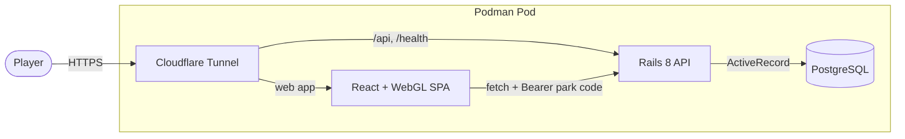

  <picture>
    <source media="(prefers-color-scheme: dark)" srcset="../assets/logo-dark.png">
    
  </picture>

<h1 align="center">The Keeper's Handbook</h1>

  <em>Everything behind the glass — how Dino Park Manager is actually built.</em>

  <a href="../README.md">← Back to the game</a>

---

The [main README](../README.md) tells you what the game *is*. This handbook tells you how it *works* — the architecture, the simulation math, and every layer from the database up to the WebGL canvas.

## Start here

Pick the door that matches what you're trying to do:

| I want to... | Read |
|--------------|------|
| Understand how the whole thing fits together | [Architecture](architecture.md) |
| Learn the actual game rules and formulas | [Game Design](game-design.md) |
| Work on the Rails API | [Backend](backend.md) + [API Reference](api-reference.md) |
| Work on the React / 3D client | [Frontend](frontend.md) |
| Change the data model | [Database](database.md) |
| Run it locally | [Development](development.md) |
| Put it (or keep it) online | [Deployment](deployment.md) |

## The whole library

### [Architecture](architecture.md)
The 10,000-foot view. The four moving parts (web, API, database, tunnel), how a request flows end to end, and the single most important idea in the codebase: **compute-on-read** — the game advances time when you *read* it, so there are no background workers.

### [Game Design](game-design.md)
The design bible. Game time and the `GameClock`, the health / hunger / happiness formulas with their exact constants, diet and feeding, breeding and genetics (mutations, generations, genetic quality), the economy, the research tree, food production, structures, attractions, diseases, random events, goals, and the prestige / win loop.

### [Backend](backend.md)
The Rails 8 API-only app. Project layout, the **thin-controller / fat-service** convention, the domain models, the service objects that hold the simulation, JSON serialization, the player-code identity concern, and how to add a new resource end to end.

### [API Reference](api-reference.md)
Every endpoint in one place: method, path, authentication, parameters, success shape, and error responses — plus the full shape of the `/api/players/me` payload that drives the entire client.

### [Frontend](frontend.md)
The React 19 client that renders the *entire* game inside one WebGL canvas (react-three-fiber + uikit). The provider tree, bridging state across the canvas boundary, the 3D park world, the in-canvas screens, the typed API client, theming, and the tutorial system.

### [Database](database.md)
PostgreSQL via ActiveRecord. Every table and column, the relationships (with an ER diagram), the difference between **persisted tables** and **static code catalogs**, and the migration workflow.

### [Deployment](deployment.md)
How it ships. The dev and prod **Podman pods** (Postgres + Rails + web + cloudflared), Podman secrets, ports, and the **Cloudflare Tunnel** ingress that exposes it publicly.

### [Development](development.md)
Day-to-day work. Getting a stack running, the fzf-based **`cmds`** command runner, running the RSpec and Vitest suites, linting, and troubleshooting.

## System at a glance

Every box above has a home in this handbook: the [SPA](frontend.md), the [API](backend.md), the [database](database.md), and the [pod + tunnel](deployment.md).

## House rules

A few conventions hold across the whole codebase. They're explained where they live, but in one breath:

- **Compute-on-read, never background jobs.** Game time advances inside read requests. See [Architecture](architecture.md#compute-on-read).
- **Thin controllers, fat services.** Business logic lives in `app/services`, not controllers. See [Backend](backend.md).
- **Datetimes are UTC ISO-8601.** Always serialized with a trailing `Z`. See [API Reference](api-reference.md).
- **The schema is owned by migrations.** Never hand-edit the database. See [Database](database.md).
- **Identity is a bearer park code.** No passwords, by design. See [Backend](backend.md#identity).
- **Theme through tokens, not hard-coded colors.** See [Frontend](frontend.md#theming).

For the contributor-facing version of these (commit style, review standards), see the repo's [`CLAUDE.md`](../CLAUDE.md) and [`.cursor/rules`](../.cursor/rules).
