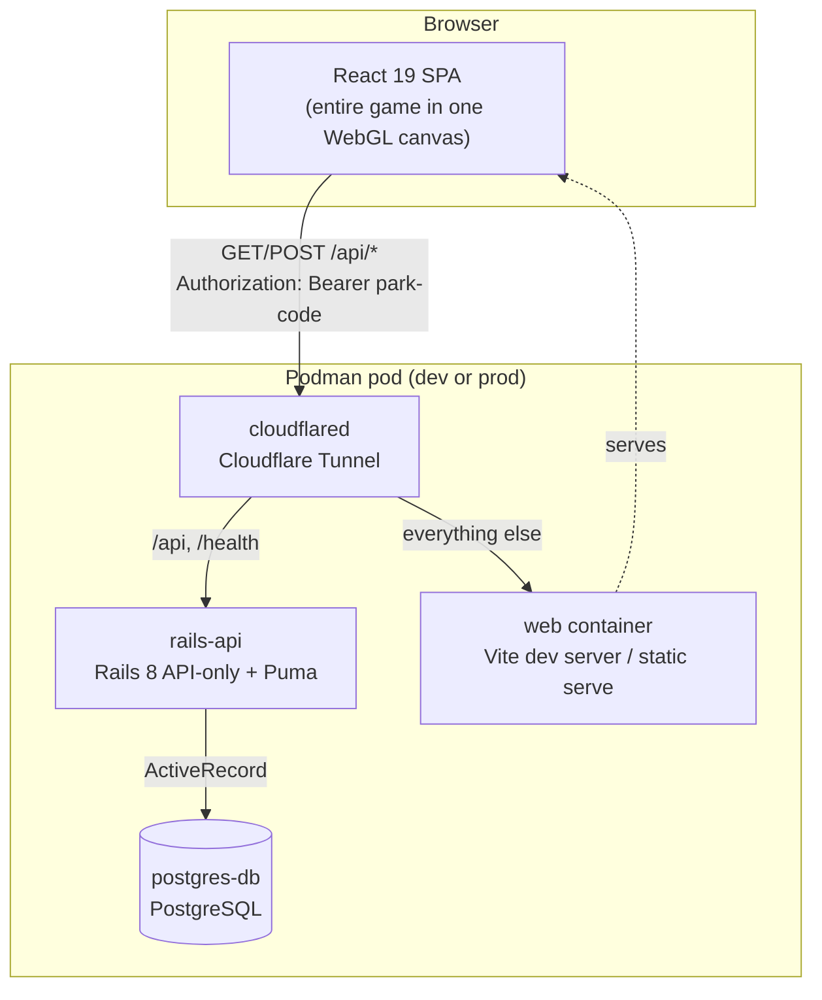
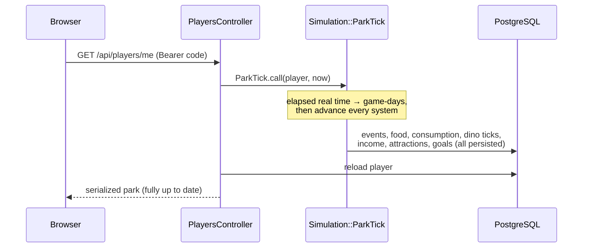
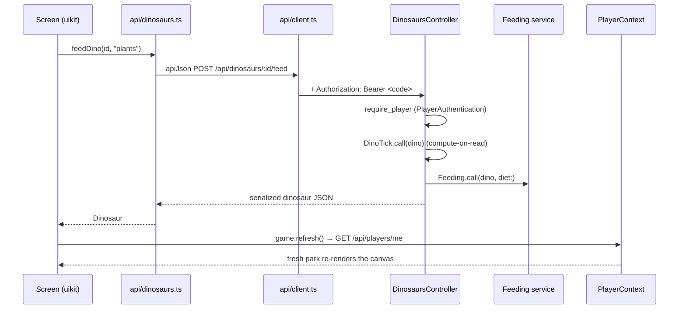

# Architecture

> How the pieces fit, how a request flows, and the one idea that shapes everything: **compute-on-read**.

[← Handbook](README.md) &middot; Next: [Game Design →](game-design.md)

---

## The shape of the system

Dino Park Manager is a classic single-page app over a JSON API, with one twist (the simulation runs on real time) and one deployment quirk (everything lives in a single Podman pod behind a Cloudflare Tunnel).



Four containers, one job each:

| Container | Role | Deep dive |
|-----------|------|-----------|
| `postgres-db` | The only source of persistent truth. | [Database](database.md) |
| `rails-api` | Stateless JSON API; holds all game logic. | [Backend](backend.md) |
| `web` | Serves the SPA (Vite in dev, static files in prod). | [Frontend](frontend.md) |
| `cloudflared` | Outbound tunnel that publishes the pod to the internet. | [Deployment](deployment.md) |

There are **no background workers, no job queue, no Redis, no WebSockets, and no Action Cable**. The API is a plain request/response service. That is a deliberate consequence of the simulation model below.

## The two halves

### Frontend — one canvas to rule them all

The client is a React 19 + TypeScript app built with Vite, but it is unusual: the **entire UI renders inside a single WebGL `<canvas>`** using [react-three-fiber](https://r3f.docs.pmnd.rs/) for the 3D park and [@react-three/uikit](https://github.com/pmndrs/uikit) for all the menus and HUD. There is no DOM-based UI framework — MUI and React Router were removed in the WebGL migration.

State that can't cross the canvas boundary (React Context doesn't, by default) is read *outside* the canvas and re-provided *inside* it. The full story is in [Frontend](frontend.md).

### Backend — thin controllers, fat services

The API is **API-only Rails 8** (`config.api_only = true`). Controllers are deliberately thin: they authenticate the player, parse params, call a service or model, and render JSON. Everything interesting — the simulation, breeding, the economy — lives in plain-Ruby **service objects** under `app/services`. Details in [Backend](backend.md).

## Compute-on-read

This is the single most important concept in the codebase. Read it once and the rest of the project makes sense.

### The problem

The park is supposed to keep living when you're not looking. Dinos get hungry, eggs hatch, farms produce food, droughts strike, and income accrues — continuously, in real time. The naïve way to do that is a background job that ticks every player's park every few seconds. That needs a scheduler, a worker process, locking, and a lot of wasted work on parks nobody is watching.

### The solution

Instead, **nothing happens until you ask.** The world is stored as a set of facts plus the timestamp of when each was last updated. When you read your park, the API looks at how much real time has elapsed since those timestamps, converts it to game-time, and fast-forwards the simulation right then — inside the read request — before serializing the response.



`Simulation::ParkTick` runs each subsystem in a fixed order:

```ruby
Events.call(player, now:)              # roll/expire weather & disasters
FoodCollection.call(player, now:)      # farms produce into food stores
Consumption.call(player, now:)         # habitats/dinos eat, hunger updates
player.dinosaurs.alive.find_each { |d| DinoTick.call(d, now:) }  # per-dino stats
Economy.passive_income(player, now:)   # currency from living dinos
AttractionIncome.call(player, now:)    # currency from attractions
Goals::Evaluation.call(player, now:)   # award goals, set "won"
```

Order matters: food is produced before it's eaten, dinos tick after they've eaten, and goals are checked last so a just-met win condition is recognized immediately.

### Where time actually advances

| Trigger | What ticks |
|---------|-----------|
| `GET /api/players/me` | The whole park (`ParkTick`). |
| `POST /api/prestige` | The whole park first (so a fresh win counts), then reset. |
| `GET/POST /api/dinosaurs/:id*` | Just that dinosaur (`DinoTick`) before the action. |
| `POST /api/breedings` | Both parents tick before the compatibility check. |

### The rules that keep it sane

- **Game time scale** is controlled by one env var, `GAME_DAY_REAL_MINUTES` (default **60** → one game-day per real hour). See [Game Design → Game time](game-design.md#game-time).
- **Watermarks, not wall-clock.** Each subsystem advances its own `last_*_at` timestamp by whole game-days and carries the remainder forward, so partial days are never lost or double-counted.
- **A catch-up cap** (`MAX_CATCHUP_DAYS = 3650`, ~10 game-years) bounds the work done after a very long absence.
- **Determinism where it counts.** Event rolls are seeded from the player id and the absolute game-day, so the same idle gap always produces the same weather. Services that use randomness accept an injectable RNG/clock so specs are deterministic.

### Why this is the right call here

- **No infrastructure** for time: no scheduler, no workers, no queue.
- **Zero work** for parks nobody is reading.
- **Trivially horizontal:** the API is stateless; any instance can serve any request because the truth (and the timestamps) live in Postgres.

The trade-off — a read can do real work, and a player who never opens the game is "frozen" — is exactly what you want for an idle game.

## The request lifecycle

A representative write (feeding a dinosaur) end to end:



Two things worth noting:

1. **The client doesn't poll.** There is no interval refresh. After any mutation, the relevant screen calls `game.refresh()`, which re-fetches `/api/players/me` (re-running `ParkTick`). The on-screen "Day N" label is computed locally from the park's creation time purely for display.
2. **Every authenticated request carries the park code** as a bearer token; the API resolves the player from it on every call. See [Identity](backend.md#identity).

## Technology choices

| Layer | Choice | Why it's here |
|-------|--------|---------------|
| 3D / UI | three.js via react-three-fiber + uikit | The park *is* the UI; one renderer draws both the world and the menus. |
| SPA | React 19 + TypeScript + Vite | Fast dev loop, strict types over the API payloads. |
| API | Rails 8, API-only | Batteries-included models + migrations; the simulation reads cleanly as Ruby services. |
| DB | PostgreSQL | Relational data (players → habitats → dinos → lineage) with `jsonb` for flexible per-dino fields. |
| Orchestration | Podman pods (`play kube`) | One declarative file brings up the whole stack; rootless and daemonless. |
| Ingress | Cloudflare Tunnel | Public HTTPS with no inbound ports or load balancer. |
| Identity | Bearer "park code" | Zero-friction saves for a casual game; no password surface. |

For the deeper rationale and conventions behind each, follow the per-layer docs linked throughout.

## Where to go next

- The rules of the simulation itself: **[Game Design](game-design.md)**.
- How the API is organized: **[Backend](backend.md)**.
- How the client renders all this: **[Frontend](frontend.md)**.
