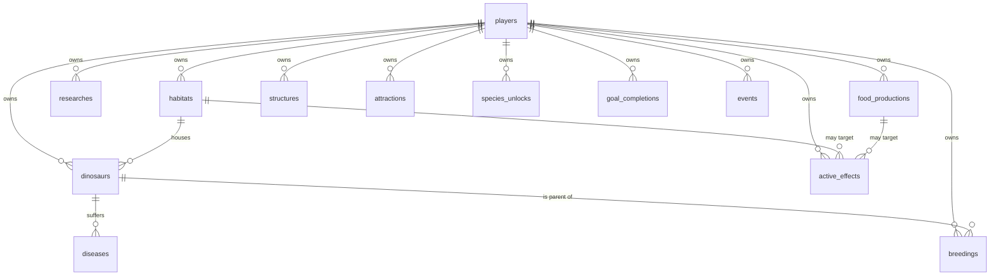

# Database

> PostgreSQL via ActiveRecord — every table, how they relate, and the migration workflow.

[← Frontend](frontend.md) &middot; [Handbook](README.md) &middot; Next: [Deployment →](deployment.md)

The schema is owned by **migrations** in [`api/db/migrate`](../api/db/migrate); the generated [`db/schema.rb`](../api/db/schema.rb) is the source of truth Rails loads from. **Never hand-edit the database or `schema.rb`** — add a migration.

## Persisted vs. catalog

Only *per-player state* lives in tables. Static game *content* — the species roster, research tree, terrain, disease, event, goal, structure, attraction, and farm definitions — lives in Ruby [catalogs](backend.md#static-catalogs-plain-ruby-modules), not the DB. A row like `species_unlocks` records *that you unlocked Allosaurus*; the Allosaurus's stats come from the `Species` catalog in code.

## Entity map



Everything hangs off **`players`** — the aggregate root. Deleting a player cascades to all of it (`dependent: :destroy`), which is exactly what [prestige](game-design.md#prestige--winning) leans on when it wipes a park.

## Tables

### `players` — the root
Identity + global resources. `player_code` (unique) is the login. Holds `currency`, `food_plants/meat/fish`, `prestige_level`, `won`, and the compute-on-read watermarks `last_income_at`, `last_consumed_at`, `last_event_roll_at`.

### `habitats`
`terrain`, `capacity`, `level`, `happiness_modifier`, `food_stockpile` (local grazing), and optional climate overrides `temperature`/`humidity`. Belongs to a player; dinosaurs reference it (nullified if it's removed).

### `dinosaurs`
The biggest table. Fixed traits (`species`, `period`, `gender`, `color`, `size_lbs`, `diet_primary/secondary`, `preferred_terrain`, `social_structure`, `temperature_min/max`) and live stats (`health`, `hunger`, `happiness`, `reproduction_readiness`). Plus `generation`, `genetics_quality`, `alive`, `quarantined`, and `stats_updated_at` (the per-dino tick watermark).

Three `jsonb` columns keep flexible data without extra tables: `mutation_traits`, `diet_restrictions` (allergies), and `health_history`. Self-referential `parent_a_id`/`parent_b_id` record lineage; `habitat_id` is optional.

### `diseases`
An illness on a dinosaur: `kind` (validated against `DiseaseCatalog`), `started_at`, and `cured_at` (null = active). The active/cured distinction is a timestamp, so history is preserved.

### `breedings`
An incubating egg: `parent_a_id`, `parent_b_id`, `offspring_id` (set on hatch), `status` (`incubating`/`hatched`/`claimed`), `hatches_at`, and an optional `requested_trait`. All three dino references are foreign keys into `dinosaurs`.

### `researches` / `species_unlocks` / `goal_completions`
Three "the player has done X" join tables, each unique per `(player_id, key)`: a researched `tech_key`, an unlocked `species_key`, or a completed `goal_key`. Idempotent by construction.

### `food_productions`
A built farm: `kind`, `level`, `last_collected_at` (its production watermark), and `prey_population`/`prey_capacity` for meat/fish farms with finite pools.

### `structures` / `attractions`
Built facilities and attractions: `kind` (+ `level`). `attractions` also tracks `last_collected_at` for income. Both are unique per `(player_id, kind)`.

### `active_effects`
A live weather/disaster modifier: `kind`, `multiplier`, `expires_at`, and an optional `habitat_id` **or** `food_production_id` naming what it hits. Swept when expired on the next read.

### `events`
The activity feed: `kind` (`birth`, `death`, `research`, `build`, `upgrade`, `disease`, `cure`, `acquire`, `goal`, …) and a human `message`. Indexed by `(player_id, created_at)` for the recent-activity panel.

## Indexes & integrity

- Every child table indexes `player_id` (the universal query path).
- "Has-done" tables (`researches`, `species_unlocks`, `goal_completions`, `structures`, `attractions`) use **unique composite indexes** to prevent duplicates.
- `players.player_code` is unique (it's the credential).
- Foreign keys are declared at the DB level for every relationship, including the three self/cross references from `breedings` and `dinosaurs` into `dinosaurs`.

## Migration workflow

```bash
cd api
bundle exec rails generate migration AddFooToBar foo:string
bundle exec rails db:migrate          # applies + regenerates db/schema.rb
```

In containers, the [`cmds database`](development.md#the-cmds-cli) menu wraps `db:migrate`, `db:prepare`, `db:seed`, a `psql` shell, and backup/restore. The Rails container runs `db:prepare` automatically on boot, so a fresh pod comes up migrated.

Rules of the road (also in [`CLAUDE.md`](../CLAUDE.md)): never edit an applied migration — add a new one; never hand-edit data — go through models/migrations.
