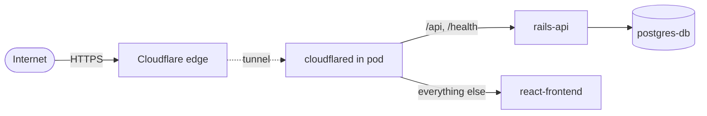

# Deployment

> One Podman pod, four containers, and a Cloudflare Tunnel — dev and prod from the same shape.

[← Database](database.md) &middot; [Handbook](README.md) &middot; Next: [Development →](development.md)

The whole stack ships as a **Podman pod** described declaratively in [`podman/`](../podman) and brought up with `podman play kube`. There are two pods — dev and prod — that share a layout and differ in ports, networking, and how the frontend is served.

## The pod model

Each pod runs four containers, named `{pod}-{container}` by Podman (e.g. `dpm-dev-pod-rails-api`):

| Container | Image | Role |
|-----------|-------|------|
| `postgres-db` | `postgres:latest` | The database; data on a named volume. |
| `rails-api` | `ruby:3.3` | Installs gems, runs `db:prepare`, starts Puma. |
| `react-frontend` | `node:20-alpine` | Dev: Vite HMR. Prod: `vite build` then static `serve`. |
| `cloudflared` | `cloudflare/cloudflared` | Outbound tunnel; no inbound ports. |

The app containers **bind-mount the source from the host** (`api/`, `frontend/`, `cloudflared/`), so in dev your edits are live. There is no custom Docker image to build — the containers install dependencies on boot.

## Dev pod — [`podman/dpm-dev.yaml`](../podman/dpm-dev.yaml)

Pod `dpm-dev-pod`, normal port mappings, DB on a `dpm-dev-db-data-claim` volume.

| Container | Host port | Key env |
|-----------|:---------:|---------|
| `postgres-db` | 5432 | `POSTGRES_DB=dpm-dev-db`, password ← secret |
| `rails-api` | 5000 | `RAILS_ENV=development`, `DB_*`, `PORT=5000`, `SECRET_KEY_BASE` ← secret |
| `react-frontend` | 3000 | Vite dev server, `--host 0.0.0.0 --port 3000` |
| `cloudflared` | — | `tunnel --config /etc/cloudflared/config.yml run` |

Open **http://localhost:3000** and a park is created automatically; the Vite dev server proxies `/api` to `:5000`.

## Prod pod — [`podman/dpm-prod.yaml`](../podman/dpm-prod.yaml)

Pod `dpm-prod-pod`. Same four containers, with production differences:

| Item | Dev | **Prod** |
|------|-----|----------|
| Networking | port mappings | `hostNetwork: true` (binds directly on the host) |
| Postgres port | 5432 | **5452** (`PGPORT`, avoids clashing with a dev pod) |
| Rails port | 5000 | **18081** |
| Frontend | Vite dev `:3000` | `vite build` → `serve -s dist -l 3020` |
| `RAILS_ENV` | development | production |
| Secrets | `dpm-dev-secrets` | `dpm-prod-secrets` |
| DB name | `dpm-dev-db` | `dpm-prod-db` |
| Volume | `dpm-dev-db-data-claim` | `dpm-prod-db-data-claim` |
| Tunnel config | `config.yml` | `config.prod.yml` |

In prod the frontend is built to static files and served by `serve`; it uses **relative** `/api` URLs, so the tunnel (not the frontend) routes API calls to Rails.

> The historical root-README "Services" table listed prod as 5432/5000/80 — that's wrong. The live prod ports are **5452 / 18081 / 3020**, per the pod YAML and tunnel config.

## Secrets

Config secrets are **Podman secrets**, never committed. Templates live in the repo; the real files are gitignored.

| Secret | File template | Keys |
|--------|---------------|------|
| `dpm-dev-secrets` | [`podman/secrets.dev.example.yaml`](../podman/secrets.dev.example.yaml) | `db-password`, `secret-key-base` |
| `dpm-prod-secrets` | [`podman/secrets.prod.example.yaml`](../podman/secrets.prod.example.yaml) | `db-password`, `secret-key-base` |

The pod YAMLs pull these into `POSTGRES_PASSWORD`, `DB_PASSWORD`, and `SECRET_KEY_BASE` via `secretKeyRef`.

```bash
cp podman/secrets.dev.example.yaml podman/secrets.dev.yaml   # then edit values
openssl rand -hex 64                                         # a strong secret-key-base
podman play kube podman/secrets.dev.yaml                     # load BEFORE starting the pod
```

Podman secrets are immutable — to rotate, `podman secret rm <name>` then re-load. The [`cmds secrets`](development.md#the-cmds-cli) menu wraps copy/generate/load/list/rotate.

## Cloudflare Tunnel

Public HTTPS with **no inbound ports and no load balancer** — `cloudflared` dials out and Cloudflare routes traffic back through it.

| Env | Tunnel | Hostname | Config |
|-----|--------|----------|--------|
| Dev | `dms-dev` | `dms-dev.faheemlabs.com` | [`cloudflared/config.yml`](../cloudflared/config.yml) |
| Prod | `dms-prod` | `dms.faheemlabs.com` | [`cloudflared/config.prod.yml`](../cloudflared/config.prod.yml) |

Ingress rules route by path (order matters):

1. `^/api/.*` → Rails (`:5000` dev / `:18081` prod)
2. `/health` → Rails
3. everything else → the frontend (`:3000` dev / `:3020` prod)
4. catch-all → `404`

Tunnel credentials live in `cloudflared/creds/<UUID>.json` and are **gitignored**. Any dev tunnel hostname must also be allow-listed in [`frontend/vite.config.ts`](../frontend/vite.config.ts) (`allowedHosts`) and [`api/config/environments/development.rb`](../api/config/environments/development.rb) (`config.hosts`) so Vite and Rails accept the forwarded `Host`. `cmds cf` wraps tunnel login/create/route/info.



## Lifecycle

```bash
# Start / stop
podman play kube podman/dpm-dev.yaml
podman pod stop dpm-dev-pod

# Full reset (drops the database volume)
podman pod rm -f dpm-dev-pod && podman volume rm dpm-dev-db-data-claim
```

All of this — start, stop, rebuild, reset-with-DB, logs, pre-pulling images — is in the [`cmds pods`](development.md#the-cmds-cli) menu. The pod's `restartPolicy: OnFailure` brings crashed containers back automatically.

## Production notes

- Rails prod (`config/environments/production.rb`) sets `force_ssl` / `assume_ssl` (TLS is terminated at Cloudflare) and logs to STDOUT.
- Puma threads come from `RAILS_MAX_THREADS`; it's single-process unless `WEB_CONCURRENCY` is set.
- `SECRET_KEY_BASE` is required in production and supplied by the `dpm-prod-secrets` secret.
- First boot runs `db:prepare`, so the prod database is created and migrated automatically.

For day-to-day commands and local-without-Podman workflows, see **[Development](development.md)**.
